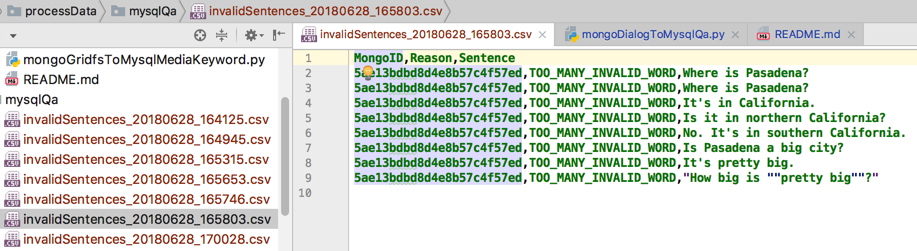
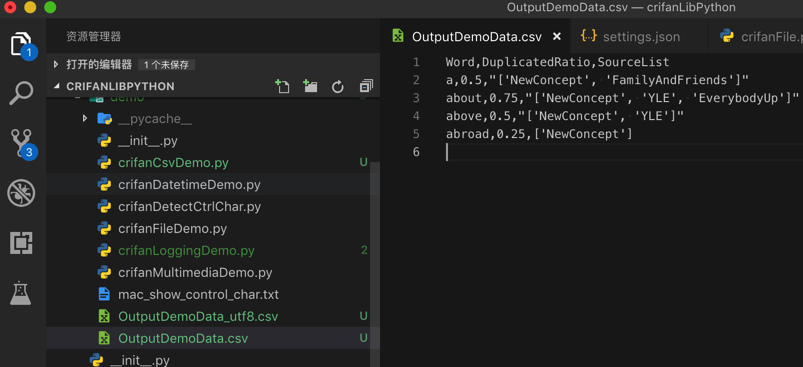
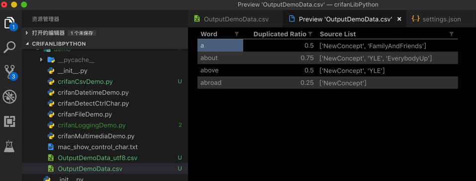
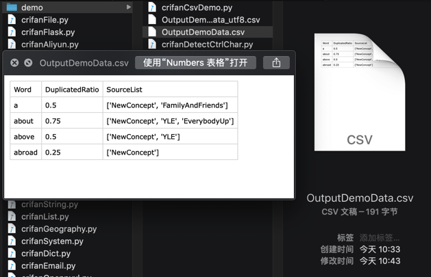

# 处理csv

已把`csv`处理相关代码，整理成独立函数。

最新代码详见：

* https://github.com/crifan/crifanLibPython/blob/master/python3/crifanLib/crifanCsv.py
  * https://github.com/crifan/crifanLibPython/blob/master/crifanLib/demo/crifanCsvDemo.py

下面分别介绍：

## python读取`csv`文件

核心代码`loadCsvFromFile`：

```python
import codecs
import csv

with codecs.open(csvFilePath, "r", encoding="utf-8") as csvFp:
    csvReader = csv.reader(csvFp)
    csvHeaders = next(csvReader) # <class 'list'>: ['url', '品牌', '子品牌', '车型', '车系']
    for eachRowList in csvReader:
        print("eachRowList=%s" % eachRowList)
        # eachRowList=['https://car.autohome.com.cn/pic/series-s19501/3548.html#pvareaid=2042220', 'Elemental', 'Elemental', '2014款 基本型', 'Elemental RP1']
```

已封装成函数：

```python
def loadCsvFromFile(csvFilePath, fileEncoding="utf-8", isReturnDictList=True):
    """read data from csv file

    Args:
        csvFilePath (str): full csv file path
        fileEncoding (str): file encoding, default to 'utf-8'
        isReturnDictList (bool): return data is row dict list or tuple(header list, row list list)
    Returns:
        isReturnDictList=True  -> csv row dict list
        isReturnDictList=False -> (csv header list, csv row data list)
    Raises:
    """
    csvDictList = []

    csvHeaderList = []
    csvRowListList = []

    with codecs.open(csvFilePath, "r", encoding=fileEncoding) as csvFp:
        csvReader = csv.reader(csvFp)
        csvHeaderList = next(csvReader)
        print("csvHeaderList=%s" % csvHeaderList)
        # <class 'list'>: ['url', '品牌', '子品牌', '车型', '车系']
        # ['appName', 'pkgName', 'authorName', 'categoryName', 'appDownCount', 'apkUrl', 'detailUrl', 'searchKeyword']
        for eachRowList in csvReader:
            # print("eachRowList=%s" % eachRowList)
            # eachRowList=['https://car.autohome.com.cn/pic/series-s19501/3548.html#pvareaid=2042220', 'Elemental', 'Elemental', '2014款 基本型', 'Elemental RP1']
            # eachRowList=['传奇世界手游', 'com.tencent.cqsj', '盛大游戏', '网络游戏', '2577672', 'https://imtt.dd.qq.com/16891/apk/6B6261E845EB53DF06F6DFBE884B61C8.apk?fsname=com.tencent.cqsj_3.6.1.20_3006.apk&csr=1bbd', 'https://sj.qq.com/myapp/detail.htm?apkName=com.tencent.cqsj', '传奇']
            csvRowListList.append(eachRowList)

    if isReturnDictList:
        for eachRowList in csvRowListList:
            curRowDict = {}
            for curIdx, curHeader in enumerate(csvHeaderList):
                curRowValue = eachRowList[curIdx]
                curRowDict[curHeader] = curRowValue

            csvDictList.append(curRowDict)

        return csvDictList
    else:
        return csvHeaderList, csvRowListList
```

调用：

```python
resultRowDictList = loadCsvFromFile(InputYingYongBaoSearchResultFullPath)
```

## 新建=写入 csv文件

```python
rowValueList = [mongoId, invalidReason.name, sentence]
with codecs.open(gCurInvalidSentenceFullFilename, "a", encoding="utf-8") as csvFp:
    csvListWriter = csv.writer(csvFp)
    csvListWriter.writerow(rowValueList)
```

或：用`dict`去保存值（需要指定`header`）

```python
gInvalidSentenceCsvHeaders = [‘MongoID’, ‘Reason’, ‘Sentence’]

rowDict = {
    "MongoID": mongoId,
    # "Reason": str(invalidReason),
    "Reason": invalidReason.name,
    "Sentence": sentence
}

with codecs.open(gCurInvalidSentenceFullFilename, "a", encoding="utf-8") as csvFp:
    csvDictWriter = csv.DictWriter(csvFp, fieldnames=gInvalidSentenceCsvHeaders)
    csvDictWriter.writerow(rowDict)
```

效果：



### `saveToCsvByDictList`和`saveToCsvByHeaderAndList`

后来已封装成独立函数

代码：

```python
import codecs
import csv

def saveToCsvByDictList(csvDictList, outputFilePath):
    # generate csv headers from dict list
    firstItemDict = csvDictList[0]
    csvHeaders = list(firstItemDict.keys())
    with codecs.open(outputFilePath, "w", "UTF-8") as outCsvFp:
        csvDictWriter = csv.DictWriter(outCsvFp, fieldnames=csvHeaders)

        # write header by inner function from fieldnames
        csvDictWriter.writeheader()

        for eachRowDict in csvDictList:
            csvDictWriter.writerow(eachRowDict)

def saveToCsvByHeaderAndList(csvHeaderList, csvRowListList, outputFilePath):
    with codecs.open(outputFilePath, "w", "UTF-8") as outCsvFp:
        csvWriter = csv.writer(outCsvFp)

        # write header from list
        csvWriter.writerow(csvHeaderList)

        # type1: write each row
        # for eachRowList in csvRowListList:
        #   csvWriter.writerow(eachRowList)

        # type2: write all rows
        csvWriter.writerows(csvRowListList)
```

> #### info::`writeheader`是后来新增的
> 
> `writeheader()`：是`python 2.7`和`Python 3.2`之后才新增的
> * 当然也可以自己写：
  ```python
  dw.writerow( dict((f,f) for f in dr.fieldnames) )
  output.writerow(dict(zip(dr.fieldnames, dr.fieldnames)))
  ```
> * 其实官方库的内部也是类似的实现
  ```python
  header = dict(zip(self.fieldnames, self.fieldnames))
  self.writerow(header)
  ```

调用举例：

文件：`crifanLib/demo/crifanCsvDemo.py`

```python
OutputFilenameByHeaderAndList = "OutputDemoData_ByHeaderAndList.csv"
OutputFilenameByDictList = "OutputDemoData_ByDictList.csv"

OutputCsvHeader = ["单词", "重复频率", "来源列表"]

curFile = os.path.abspath(__file__)
curFolder = os.path.dirname(curFile)

DemoRowListList = [
  ["a", 0.5, ['NewConcept', 'FamilyAndFriends']],
  ["about", 0.75, ['NewConcept', 'YLE', 'EverybodyUp']],
  ["above", 0.5, ['NewConcept', 'YLE']],
  ["abroad", 0.25, ['NewConcept']]
]

DemoDictList = [
  {
    "单词": "a",
    "重复频率": 0.5,
    "来源列表": ['NewConcept', 'FamilyAndFriends'],
  },
  {
    "单词": "about",
    "重复频率": 0.75,
    "来源列表": ['NewConcept', 'YLE', 'EverybodyUp'],
  },
  {
    "单词": "above",
    "重复频率": 0.5,
    "来源列表": ['NewConcept', 'YLE'],
  },
  {
    "单词": "abroad",
    "重复频率": 0.25,
    "来源列表": ['NewConcept'],
  },
]

def demoCsvOutput():
  # Demo1: save by list of each row item list
  fullFilePathByHeaderAndList = os.path.join(curFolder, OutputFilenameByHeaderAndList)
  saveToCsvByHeaderAndList(OutputCsvHeader, DemoRowListList, fullFilePathByHeaderAndList)

  # Demo1: save by list of dict, not need assign header
  fullFilePathByDictList = os.path.join(curFolder, OutputFilenameByDictList)
  saveToCsvByDictList(DemoDictList, fullFilePathByDictList)

  """
  单词,重复频率,来源列表
  a,0.5,"['NewConcept', 'FamilyAndFriends']"
  about,0.75,"['NewConcept', 'YLE', 'EverybodyUp']"
  above,0.5,"['NewConcept', 'YLE']"
  abroad,0.25,['NewConcept']
  """
```

输出csv文件效果：



csv（作为表格文件的）预览效果：



Mac中自带的预览的csv的效果：


