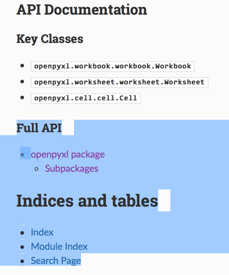

# openpyxl

* `openpyxl`
  * 一句话描述：`read/write Excel 2010 xlsx/xlsm files`
* 文档
  * 首页
    * https://openpyxl.readthedocs.io/en/stable/
  * 入门
    * Manipulating a workbook in memory — openpyxl 2.5.3 documentation
      * http://openpyxl.readthedocs.io/en/stable/tutorial.html
  * API
    * 说明：开发期间如果遇到一些`对象`，需要查询其属性、函数等细节，可以去参考这些API文档
      * 
    * API入口
      * openpyxl package — openpyxl 3.0.7 documentation
        * http://openpyxl.readthedocs.io/en/stable/api/openpyxl.html
    * 核心的类(API)
      * 最顶层的： `openpyxl.workbook.workbook.Workbook` = 对应excel文件
        * https://openpyxl.readthedocs.io/en/stable/api/openpyxl.workbook.workbook.html#openpyxl.workbook.workbook.Workbook
      * 第二层的：`openpyxl.worksheet.worksheet.Worksheet` = 对应excel内单个的tab页
        * https://openpyxl.readthedocs.io/en/stable/api/openpyxl.worksheet.worksheet.html#openpyxl.worksheet.worksheet.Worksheet
      * 最底层的： `openpyxl.cell.cell.Cell`  = 对应`单元格`
        * https://openpyxl.readthedocs.io/en/stable/api/openpyxl.cell.cell.html#openpyxl.cell.cell.Cell
    * 相关的：样式styles (`颜色`，`对齐方式`等等)
      * openpyxl.styles package — openpyxl 3.0.7 documentation
        * http://openpyxl.readthedocs.io/en/stable/api/openpyxl.styles.html

## 安装

```bash
pip3 install openpyxl
```

### 确认已安装成功

去python的shell中导入，没问题，且能输出版本信息，即说明安装没问题

```python
➜  ~ python3
Python 3.6.1 (default, May  6 2017, 14:32:57)
[GCC 4.2.1 Compatible Apple LLVM 8.1.0 (clang-802.0.38)] on darwin
Type “help”, “copyright”, “credits” or “license” for more information.
>>> import openpyxl
>>> openpyxl.__version__
'2.4.7'
>>>
```

### 附带：安装日志

```bash
➜  ~ pip3 install openpyxl
Collecting openpyxl
  Downloading openpyxl-2.4.7.tar.gz (156kB)
    100% |████████████████████████████████| 163kB 64kB/s
Collecting jdcal (from openpyxl)
  Downloading jdcal-1.3.tar.gz
Collecting et_xmlfile (from openpyxl)
  Downloading et_xmlfile-1.0.1.tar.gz
Building wheels for collected packages: openpyxl, jdcal, et-xmlfile
  Running setup.py bdist_wheel for openpyxl … done
  Stored in directory: /Users/crifan/Library/Caches/pip/wheels/f5/c0/e2/7bd8f5f74f0c8ee97cd551409f8c8d8c388540248d32a28b99
  Running setup.py bdist_wheel for jdcal … done
  Stored in directory: /Users/crifan/Library/Caches/pip/wheels/0f/63/92/19ac65ed64189de4d662f269d39dd08a887258842ad2f29549
  Running setup.py bdist_wheel for et-xmlfile … done
  Stored in directory: /Users/crifan/Library/Caches/pip/wheels/99/f6/53/5e18f3ff4ce36c990fa90ebdf2b80cd9b44dc461f750a1a77c
Successfully built openpyxl jdcal et-xmlfile
Installing collected packages: jdcal, et-xmlfile, openpyxl
Successfully installed et-xmlfile-1.0.1 jdcal-1.3 openpyxl-2.4.7
```
