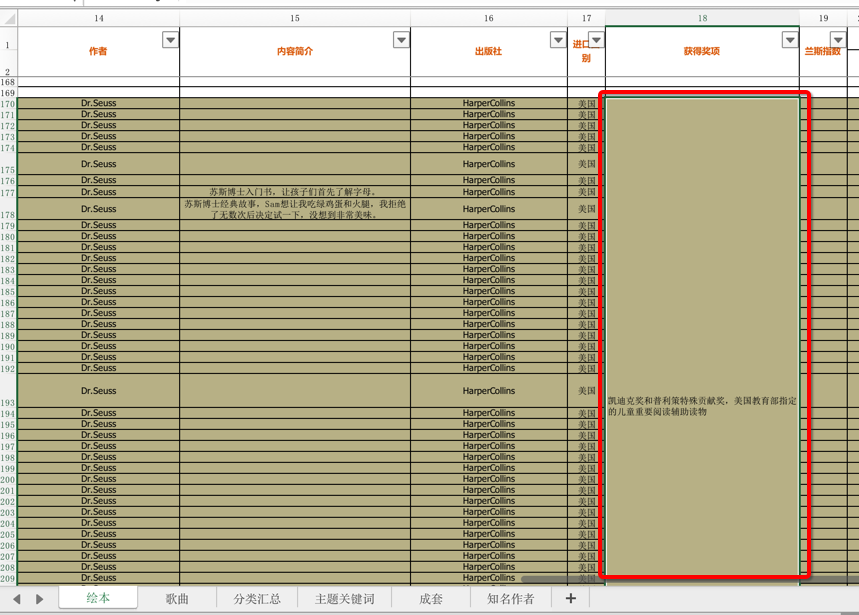
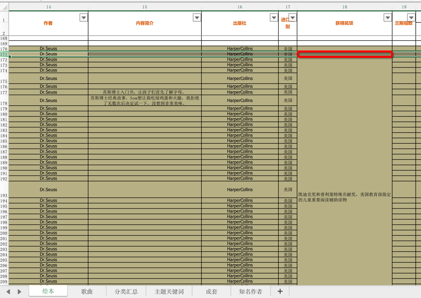
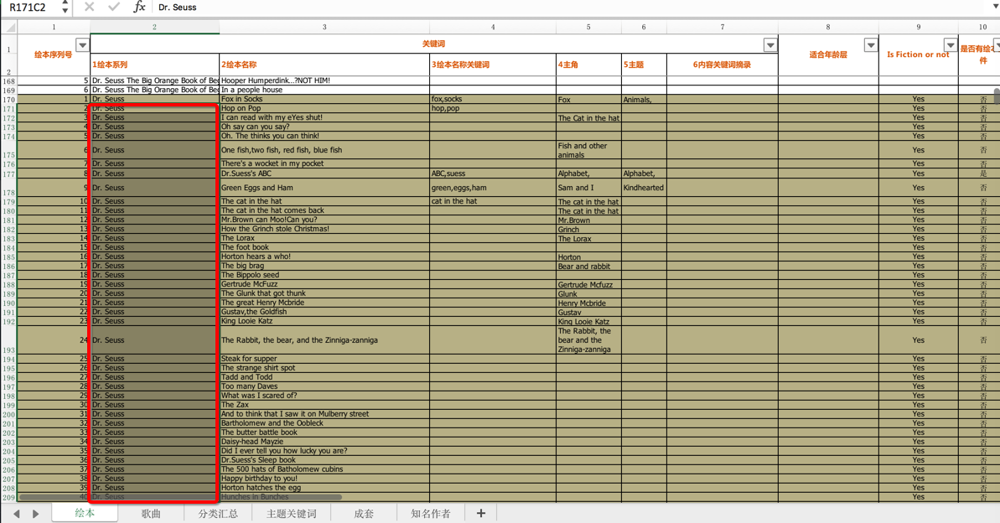
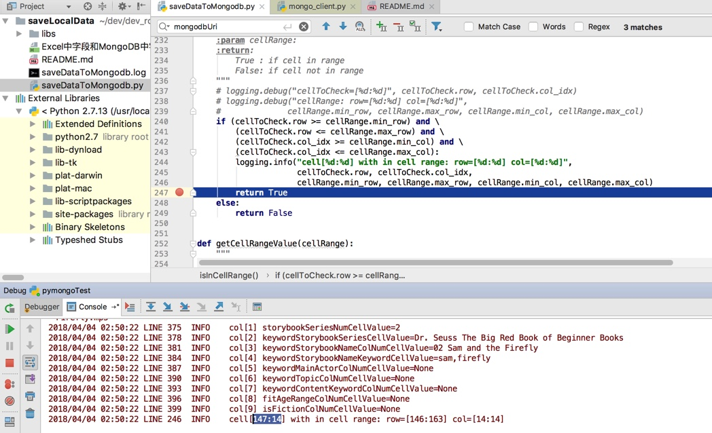
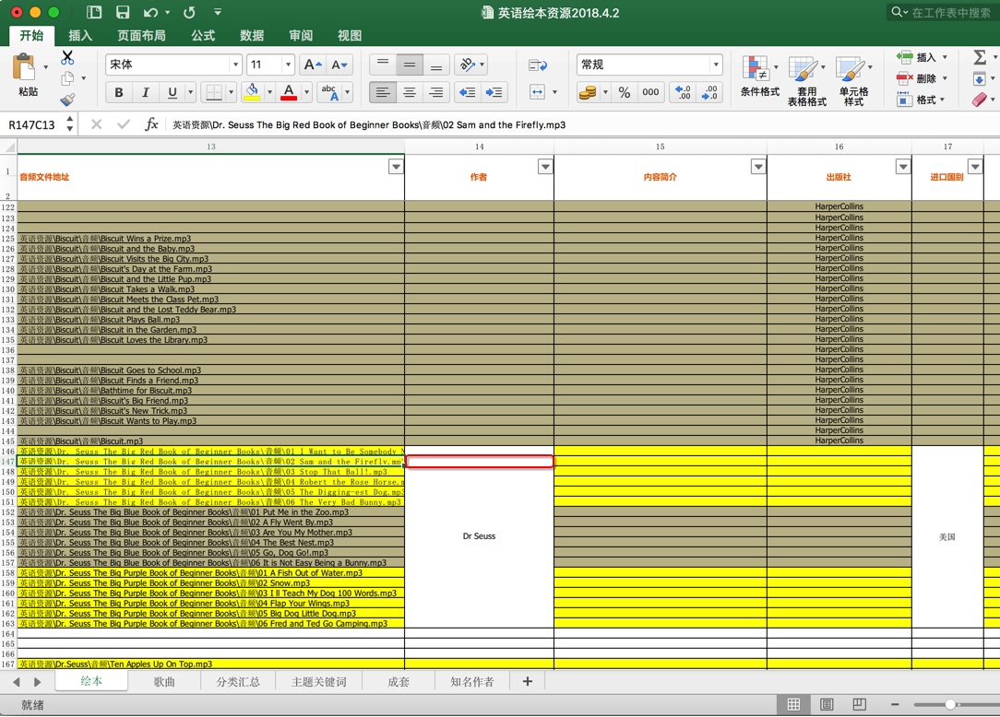
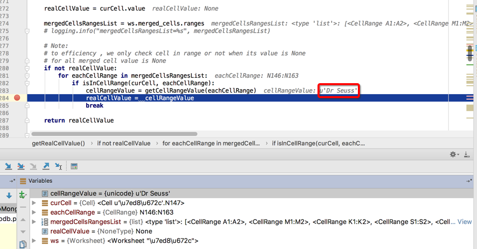

# 封装成函数

目前已把`openpyxl`常用的功能，封装成**独立函数**了。

最新完整代码详见：

https://github.com/crifan/crifanLibPython/blob/master/python3/crifanLib/thirdParty/crifanOpenpyxl.py

下面贴出部分代码供参考：

### 获取合并后单元格的原始值：`isInCellRange` + `getCellRangeValue` + `getRealCellValue`

**背景**：

用代码自动去判断，对于合并后的单元格中的内容：



（之前调试时发现的）自动检测出来后，对于后续的，单元格值是空：



但是属于同一系列的话：



那么后续单元格的值，在代码赋值时，也使用前面的值。

换句话说：

被合并后的单元的值，默认是空的

但是希望获取到被合并之前的值，即此处的合并后的左上角的第一个单元格的值

看看openpyxl是否能检测出来excel的单元格，是否是被合并的，且知道，具体合并了多少行（多少列）

这样才有利于后续单元格值为空时，使用前面的同系列的值

**代码**：

```python
from openpyxl import Workbook, load_workbook

def isInCellRange(cellToCheck, cellRange):
    """
    to check a cell whether in a cell range
    :param cellToCheck:
    :param cellRange:
    :return:
        True : if cell in range
        False: if cell not in range
    """
    # logging.debug("cellToCheck=[%d:%d]", cellToCheck.row, cellToCheck.col_idx)
    # logging.debug("cellRange: row=[%d:%d] col=[%d:%d]",
    #              cellRange.min_row, cellRange.max_row, cellRange.min_col, cellRange.max_col)
    if (cellToCheck.row &gt;= cellRange.min_row) and \
        (cellToCheck.row &lt;= cellRange.max_row) and \
        (cellToCheck.col_idx &gt;= cellRange.min_col) and \
        (cellToCheck.col_idx &lt;= cellRange.max_col):
        logging.info("cell[%d:%d] with in cell range: row=[%d:%d] col=[%d:%d]",
                     cellToCheck.row, cellToCheck.col_idx,
                     cellRange.min_row, cellRange.max_row, cellRange.min_col, cellRange.max_col)
        return True
    else:
        return False

def getCellRangeValue(cellRange):
    """
    get cell range value -&gt; the top left cell value
    :param cellRange:
    :return:
    """
    topLeftCell = ws.cell(row=cellRange.min_row, column=cellRange.min_col)
    topLeftCellValue = topLeftCell.value
    return topLeftCellValue

def getRealCellValue(ws, curCell):
    """
    for openpyxl, to get real value from row and column
    expecially for merged cell, will get its (same) value from top-left cell value

    :param row:
    :param column:
    :return:
    """

    realCellValue = curCell.value

    mergedCellsRangesList = ws.merged_cells.ranges
    # logging.info("mergedCellsRangesList=%s", mergedCellsRangesList)

    # Note:
    # to efficiency , we only check cell in range or not when its value is None
    # for all merged cell value is None
    if not realCellValue:
        for eachCellRange in mergedCellsRangesList:
            if isInCellRange(curCell, eachCellRange):
                cellRangeValue = getCellRangeValue(eachCellRange)
                realCellValue =  cellRangeValue
                break

    return realCellValue

# parse excel file
wb = load_workbook(ExcelFullFilename)
logging.info("wb=%s", wb)
# sheetNameList = wb.get_sheet_names()
# logging.info("sheetNameList=%s", sheetNameList)
ws = wb[StorybookSheetTitle]
logging.info("ws=%s", ws)

# process each row in excel
# for curRowNum in range(realContentRowStartNum, ws.max_row + 1):
for curRowNum, eachRow in enumerate(ws.iter_rows(min_row=realContentRowStartNum)):
    curRowNum += realContentRowStartNum
    logging.info("-"*30 + " row[%d] " + "-"*30, curRowNum)

    ...
    # authorColNumCellValue = ws.cell(row=curRowNum, column=AuthorColNum).value
    authorColNumCellValue = getRealCellValue(ws, eachRow[AuthorColNum - 1])
    logging.info("col[%d] authorColNumCellValue=%s", AuthorColNum, authorColNumCellValue)
    # contentAbstractColNumCellValue = ws.cell(row=curRowNum, column=ContentSimpleIntroColNum).value
    contentAbstractColNumCellValue = getRealCellValue(ws, eachRow[ContentSimpleIntroColNum - 1])
    logging.info("col[%d] contentAbstractColNumCellValue=%s", ContentSimpleIntroColNum, contentAbstractColNumCellValue)
    # publisherColNumCellValue = ws.cell(row=curRowNum, column=PublisherColNum).value
    publisherColNumCellValue = getRealCellValue(ws, eachRow[PublisherColNum - 1])
    logging.info("col[%d] publisherColNumCellValue=%s", PublisherColNum, publisherColNumCellValue)
    ...
```

可以检测到后续的，值是None的，处于被合并区域内的Cell单元格：

```bash
2018/04/04 02:50:22 LINE 246  INFO    cell[147:14] with in cell range: row=[146:163] col=[14:14]
```



对应着147行，14列的：




然后就可以通过：

`getCellRangeValue`去得到合并区域的值==合并区域的最左上角（top left）的那个单元格的值：


