# 常用功能点

此处整理出`openpyxl`中常用的**功能点**。

## 基本操作

### 读取excel文件

```python
from openpyxl import Workbook, load_workbook

wb = load_workbook(ExcelFullFilename) # work book
```

### 获取`workbook`的`sheet`

* 获取sheet列表
    ```python
    sheetNameList = wb.get_sheet_names()
    ```
* 获取某个sheet
    ```python
    ws = wb["yourSheetName"] # work sheet
    ```

### 获取`sheet`中的`cell`

```python
curCell = ws.cell(row=rowIdx, column=columnIdx)
curCellValue = curCell.value
```

## 常见操作

### 对每个row循环处理

之前去循环rows是用

```python
ws.iter_rows("A1:L2")
```

这种写法现在已废弃，建议换成：

```python
ws["A1:L2"]
```

且看了官网:

[Manipulating a workbook in memory — openpyxl 2.5.3 documentation](http://openpyxl.readthedocs.io/en/latest/tutorial.html)

发现其实两种写法都可以：

* `range string`的写法：`["XM:YN"]`，其中`X`，`Y`是字母，`M`，`N`是数字
    ```python
    cell_range = ws['A1':'C2']
    ```
* `ws`调用`iter_rows`时，传递`row`和`col`的参数
    ```python
    for row in ws.iter_rows(min_row=1, max_col=3, max_row=2):
        for cell in row:
            print(cell)
    ```

## 设置背景色

用openpyxl设置**背景色**，用`start_color`+`end_color`：

```python
nameCell.fill = PatternFill(start_color="AACF91", end_color="AACF91", fill_type="solid")
```

效果：

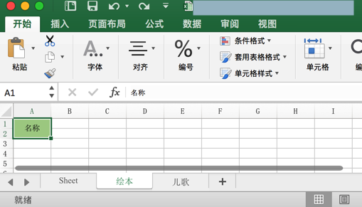

> #### danger:: 不要用`PatternFill`的`bgColor`
>
> 如果用（看起来以为可以工作的）`PatternFill`的`bgColor`：
    ```python
    nameCell.fill = PatternFill(bgColor=Color("AACF91"), fill_type="solid")
    ```
> 结果会导致黑色背景
>
> 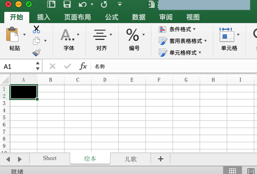

### 如何查看颜色和RGB转换HEX值

对于上述颜色设置的值`AACF91`是如何得到的？

先去查看本身excel的背景色的RGB值：

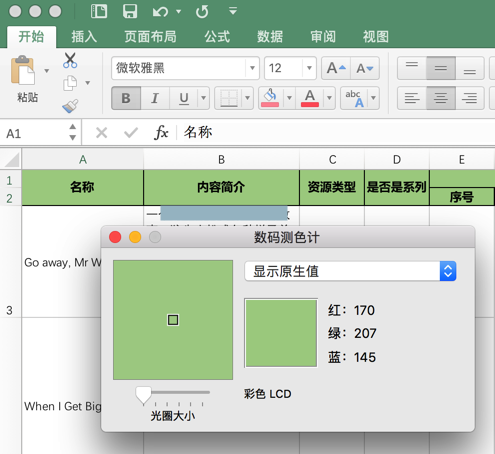

此处背景色绿色的RGB值是：`170，207，145`

去把RGB转成HEX值：

[hex color](https://www.sioe.cn/yingyong/yanse-rgb-16/)

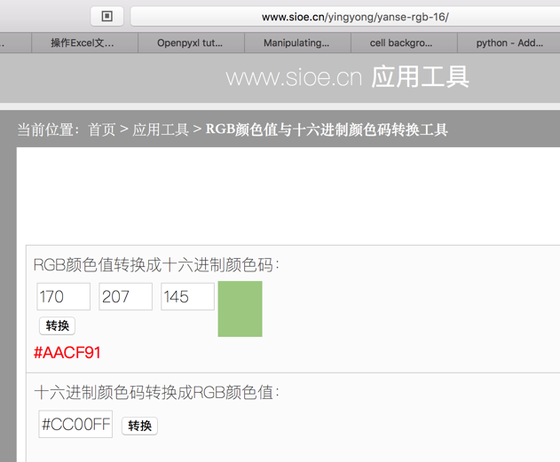

即可得到HEX值：

* RGB: `170，207，145` -> HEX: `#AACF91`

## 批量设置样式（背景色、对齐方式等）

**背景**：想要针对表头的所有的cell单元格（包括合并后的），批量去设置其样式

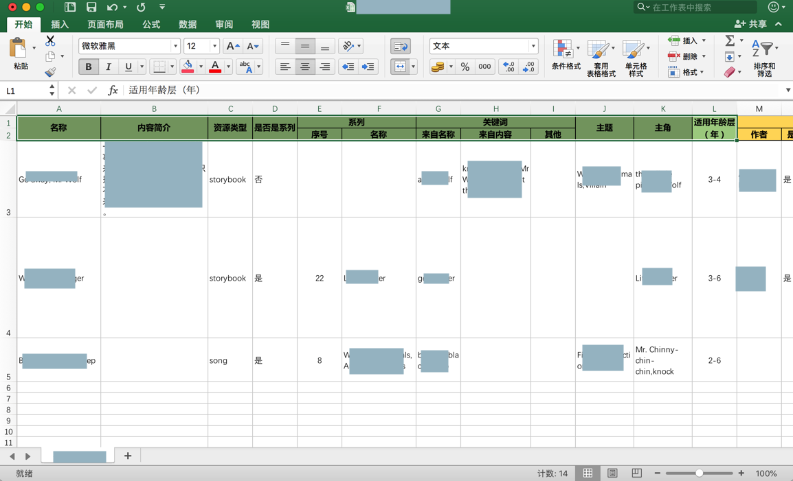

* 背景色：绿色
* 对齐方式
  * 左右：水平居中对齐
  * 上下：垂直居中对齐

**代码**：

每个单元格循环去设置

```python
aligmentCenter = Alignment(horizontal='center', vertical='center')
commonBackgroundColorHex = "AACF91"
commonFill = PatternFill(start_color=commonBackgroundColorHex, end_color=commonBackgroundColorHex, fill_type="solid")
for eachCommonRow in ws.iter_rows("A1:L2"):
    logging.info("eachCommonRow=%s", eachCommonRow)
    for eachCellInRow in eachCommonRow:
        logging.info("eachCellInRow=%s", eachCellInRow)
        eachCellInRow.alignment = aligmentCenter
        eachCellInRow.fill = commonFill
```

**效果**

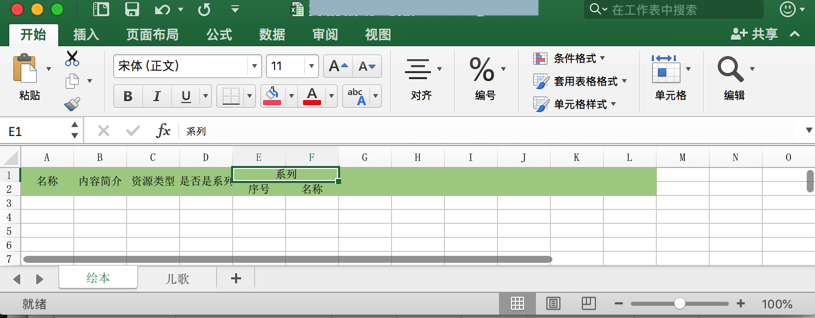

## 设置自适应列宽

**背景**：`openpyxl`可以新建excel，但是表头内容显示不全：

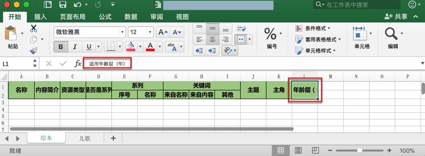

希望表头的宽度，像另外一个手动创建并设置后的，去自动适应宽度：

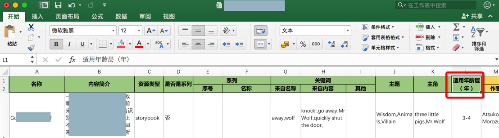

**解决办法**：

由于`openpyxl`的`sheet`中的`column_dimensions`的`auto_size`，`bestFit`，`collapsed`，都无法启到此处想要的效果：自动设置列宽

最后只能单独设置宽度：

```python
nameCell = ws["A1"]
nameCell.value = "名称"
ws.merge_cells(‘A1:A2')
ws.column_dimensions["A"].width = 15

isSeriesCell = ws["D1"]
isSeriesCell.value = "是否是系列"
ws.merge_cells(‘D1:D2')
# ws.column_dimensions["D"].auto_size = True
# ws.column_dimensions["D"].bestFit = False
# ws.column_dimensions["D"].collapsed = True
ws.column_dimensions["D"].width = 10

fitAgeRangeCell = ws["L1"]
fitAgeRangeCell.value = "适用年龄层（年）"
ws.merge_cells(‘L1:L2')
# ws.column_dimensions["L"].auto_size = True
# ws.column_dimensions["L"].bestFit = True
# ws.column_dimensions["L"].collapsed = False
ws.column_dimensions["L"].width = 14
# ws["L3"].value = "很长的值很长的值很长的值测试列宽"
```

间接实现自动设置列宽的效果：

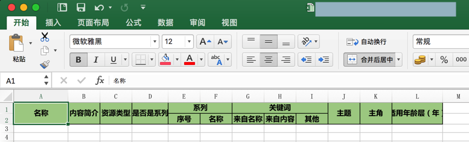

## 设置行高

**背景**：表头的部分内容由于行高太低而不显示了

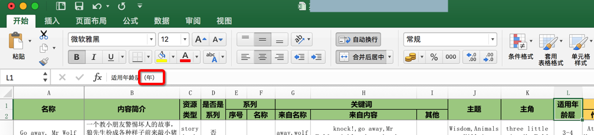

**解决办法**：增加行高

**代码**：

```python
ws.row_dimensions[1].height = 30
ws.row_dimensions[2].height = 20
```

**效果**：增加了行高，内容完全显示

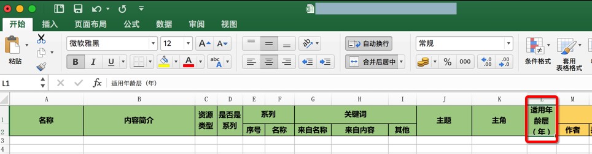

## 设置单元格自动换行

**背景**：之前已设置了 列表宽度（间接实现宽度自适应）+ 行高，导致现在显示效果很不好，有些内容没法完全显示

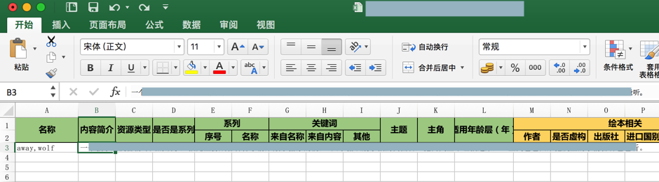

希望cell单元格的内容的自动换行。

**希望效果**：想要实现，类似于手动设置的：`设置单元格格式`->`对齐`->`文本控制`->勾选：`自动对齐`

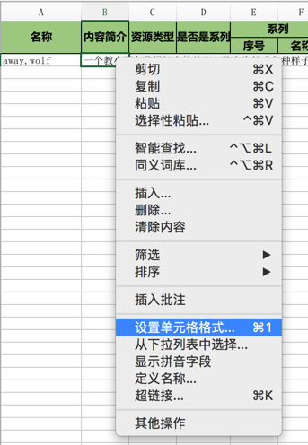

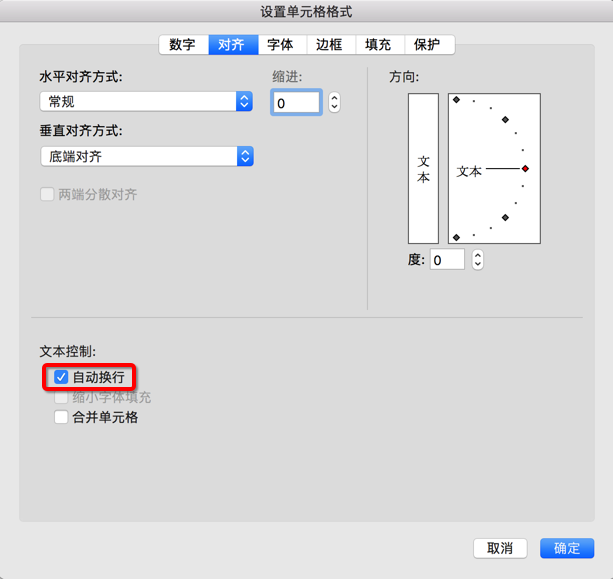

的效果：内容可以完全显示

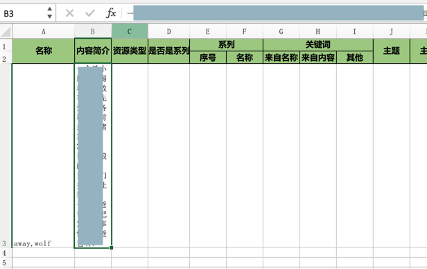

**代码**：

```python
# curCell.style.alignment.wrap_text = True #AttributeError: 'str' object has no attribute 'alignment'
curCell.alignment = Alignment(wrapText=True)
```

**效果**：很长的多行内容，可以根据宽度，自动换行，内容得以完全显示

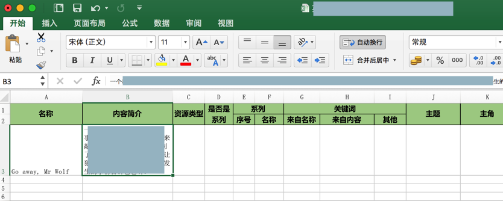
