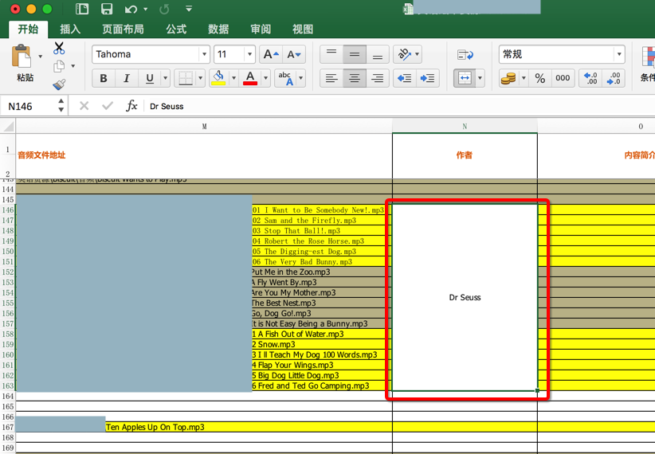
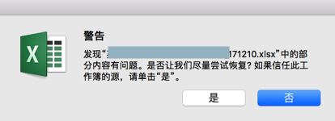
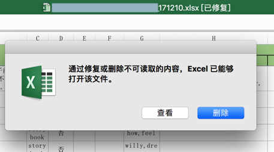
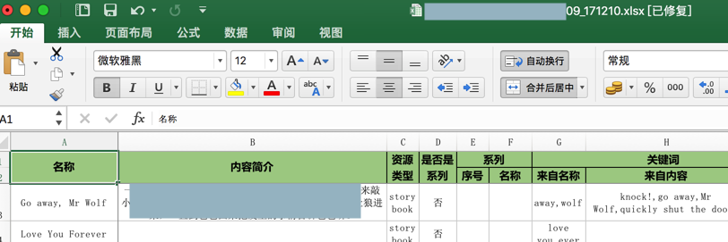
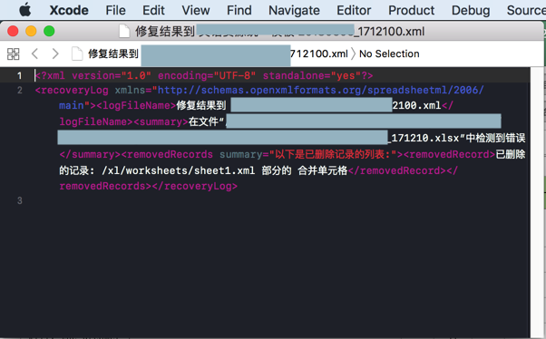
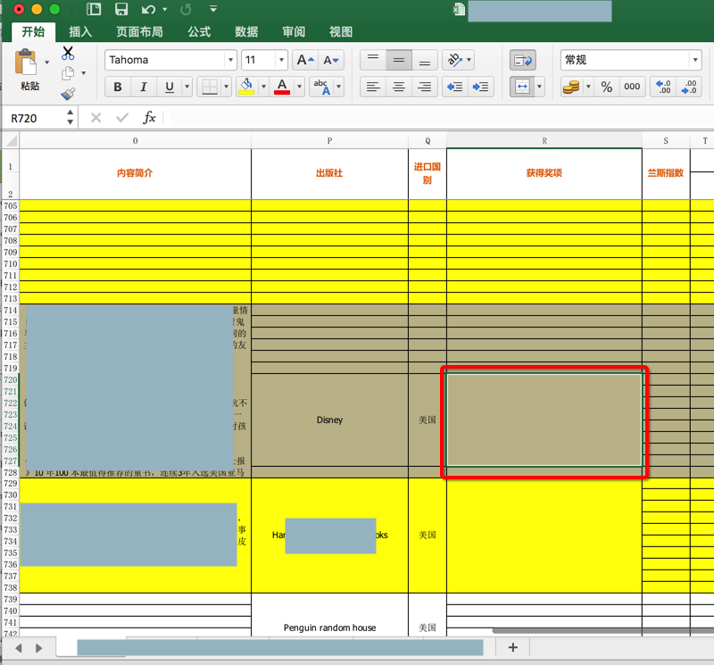

# 常见问题

## 警告：发现xlsx中的部分内容有问题。是否让我们尽量尝试恢复? 如果信任此工作簿的源，请单击"是"

**背景**：

用openpyxl去创建新excel文件，并从某原有excel中拷贝数据到新excel中

其中包括保留原先的合并后的单元格，比如：



相关代码是：

```python
def keepPrevMergedCells(wsIn, wsInCurCellRange, wsInCurRowNum, wsOut, wsOutColNum):
    """
        keep original excel’s merged cells
    """
    logging.info("keepPrevMergedCells: wsIn=%s, wsInCurCellRange=%s, wsInCurRowNum=%s, wsOut=%s, wsOutColNum=%s",
                 wsIn, wsInCurCellRange, wsInCurRowNum, wsOut, wsOutColNum)
 
    cellRangeValue = crifanLib.getCellRangeValue(wsIn, wsInCurCellRange)
    rangeMinRow = wsInCurCellRange.min_row
    rangeMinCol = wsInCurCellRange.min_col
    rangeMaxRow = wsInCurCellRange.max_row
    rangeMaxCol = wsInCurCellRange.max_col
    logging.info("curCellRange: min_row=%s, min_col=%s, max_row=%s, max_row=%s",
                 rangeMinRow, rangeMinCol, rangeMaxRow, rangeMaxCol)
    rowNumDiff = wsInCurRowNum – rangeMinRow
    logging.info("rowNumDiff=%s", rowNumDiff)
    curStartCol = wsOutColNum
    curEndCol = wsOutColNum + (rangeMaxCol – rangeMinCol)
    logging.info("curStartCol=%s, curEndCol=%s", curStartCol, curEndCol)
    if rowNumDiff > 1:
        wsOut.unmerge_cells(start_row=rangeMinRow,
                                     start_column=curStartCol,
                                     end_row=wsInCurRowNum – 1,
                                     end_column=curEndCol)
    wsOut.merge_cells(start_row=rangeMinRow,
                       start_column=curStartCol,
                       end_row=wsInCurRowNum,
                       end_column=curEndCol)
```

打开保存后的excel文件后报错：

> 发现 xlsx 中的部分内容有问题。是否让我们尽量尝试恢复? 如果信任此工作簿的源，请单击“是”。



点击`是`，然后再点击`删除`：



是可以打开的，且貌似数据也是对的：



**调试过程**：

点击`查看`，是打开了`xml`文件：

```xml
<?xml version="1.0" encoding="UTF-8" standalone="yes"?>

<recoveryLog xmlns="http://schemas.openxmlformats.org/spreadsheetml/2006/main"><logFileName>修复结果到 xxx2100.xml</logFileName><summary>在文件“/Users/xxx210.xlsx”中检测到错误</summary><removedRecords summary="以下是已删除记录的列表:"><removedRecord>已删除的记录: /xl/worksheets/sheet1.xml 部分的 合并单元格</removedRecord></removedRecords></recoveryLog>
```



最终调试到的现象是：

* 720行没问题
* 但是750行出问题

然后去原先文件看看是否有什么异常的情况：

最后找到了是原先的excel中的`702 - 727`行`R`列中：

是合并的单元格，但是内容却是**空**=`None`



**根本原因**：代码生成的excel中，某些单元格的值是无效的`None`，无法被Excel软件所识别

**解决办法**

* （不太推荐）办法1：忽略之
  * 根据提示，正常打开excel，点击删除，会删除对应无效的值
    * 后续即可正常使用excel文件
* （推荐）方法2：代码生成时，不要设置（Excel软件不支持的）`None`等值
  * 即可彻底规避掉，不会产生此问题
  * 修复后的相关代码是
    ```python
    def keepPrevMergedCells(wsIn, wsInCurCellRange, wsInCurRowNum, wsOut, wsOutColNum):
        """
            keep original excel’s merged cells
            if merged cell range itself value is None, should NOT keep merged
            otherwise will cause generated excel file corrupted
        """
        logging.info("keepPrevMergedCells: wsIn=%s, wsInCurCellRange=%s, wsInCurRowNum=%s, wsOut=%s, wsOutColNum=%s",
                    wsIn, wsInCurCellRange, wsInCurRowNum, wsOut, wsOutColNum)
    
        cellRangeValue = crifanLib.getCellRangeValue(wsIn, wsInCurCellRange)
        if not cellRangeValue:
            logging.warning("Not keep previous None or empty value of merged cells")
            return
        # then wsOut.unmerge_cells and wsOut.merge_cells is ok
    ```
