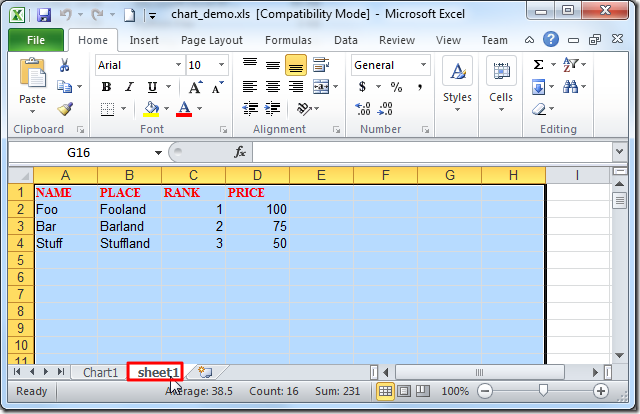
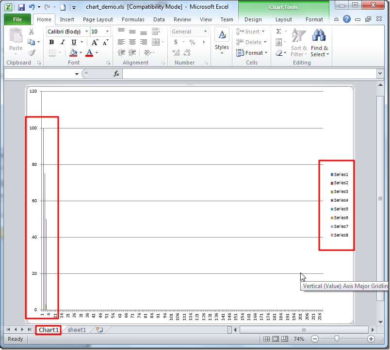

# win32com.client

此处用`win32com.client`去处理`Excel`中的**图表**，比如`Chart`、`Graph`等。

## 处理Excel的图表

在当前文件夹中新建一个空的`xls`文件：`chart_demo.xls`

用（`Python 2`的）代码：

```python
#!/usr/bin/python
# -*- coding: utf-8 -*-
"""
Function:
【已解决】Python中处理操作Excel中的图表（Chart，Graph）
https://www.crifan.com/python_process_excel_chart_graph

Author:     Crifan Li
Version:    2012-12-25
Contact:    admin at crifan dot com
"""

import os
from win32com.client import Dispatch
#from win32com.client import *

def excelChart():
    xl = Dispatch("Excel.Application")
    #xl = win32com.client.Dispatch("Excel.Application")
    print "xl=",xl

    #[1] Fail
    # xlsPath = "chart_demo.xls"
    # wb = xl.Workbooks.open(xlsPath) #pywintypes.com_error

    #[2] Fail
    # xlsPath = "D:\tmp\tmp_dev_root\python\excel_chart\chart_demo.xls"
    # absPath = os.path.abspath(xlsPath)
    # print "absPath=",absPath #absPath= D:\tmp\tmp_dev_root\python\excel_chart\        mp      mp_dev_root\python\excel_chart\chart_demo.xls
    # wb = xl.Workbooks.open(absPath) #pywintypes.com_error

    #[3] Fail
    # xlsPath = "D:\tmp\tmp_dev_root\python\excel_chart\chart_demo.xls"
    # normalPath = os.path.normpath(xlsPath)
    # print "normalPath=",normalPath #normalPath= D:  mp      mp_dev_root\python\excel_chart\chart_demo.xls
    # wb = xl.Workbooks.open(normalPath) #pywintypes.com_error

    #[4] Fail
    # rawPath = r"chart_demo.xls"
    # wb = xl.Workbooks.open(rawPath) #pywintypes.com_error
    
    #[5] OK
    xlsPath = "chart_demo.xls"
    absPath = os.path.abspath(xlsPath)
    print "absPath=",absPath #absPath= D:\tmp\tmp_dev_root\python\excel_chart\chart_demo.xls
    wb = xl.Workbooks.open(absPath) #OK
        
    #[6] OK
    # rawPath = r"D:\tmp\tmp_dev_root\python\excel_chart\chart_demo.xls"
    # wb = xl.Workbooks.open(rawPath) # OK

    xl.Visible = 1
    ws = wb.Worksheets(1)
    ws.Range('$A1:$D1').Value = ['NAME', 'PLACE', 'RANK', 'PRICE']
    ws.Range('$A2:$D2').Value = ['Foo', 'Fooland', 1, 100]
    ws.Range('$A3:$D3').Value = ['Bar', 'Barland', 2, 75]
    ws.Range('$A4:$D4').Value = ['Stuff', 'Stuffland', 3, 50]
    wb.Save()
    wb.Charts.Add()
    wc1 = wb.Charts(1)

if __name__ == "__main__":
    excelChart()
```

效果：

* Excel单元格内容
  * 
* Excel对应图表效果
  * 

## 常见问题

### `ImportError: No module named win32com.client`

代码：

```python
from win32com.client import Dispatch
```

会报错：

```bash
D:\tmp\tmp_dev_root\python\excel_chart>excel_chart.py
Traceback (most recent call last):
  File "D:\tmp\tmp_dev_root\python\excel_chart\excel_chart.py", line 13, in <module>
    from win32com.client import Dispatch
ImportError: No module named win32com.client
```

**解决办法**：下载和安装`pywin32`

**具体步骤**

去

http://sourceforge.net/projects/pywin32/files/pywin32/

下载

http://sourceforge.net/projects/pywin32/files/pywin32/Build%20218/

此处`Win7 64位 + Python 2.7.3`对应的版本：

[pywin32-218.win-amd64-py2.7.exe](http://sourceforge.net/projects/pywin32/files/pywin32/Build%20218/pywin32-218.win-amd64-py2.7.exe/download)

然后去双击安装，一路默认设置：


即可。
