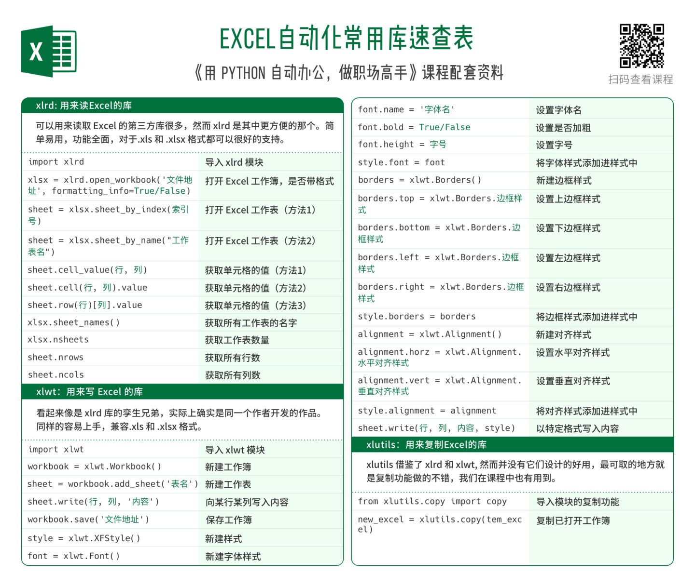
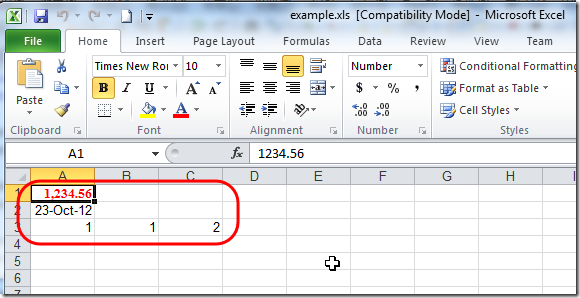

# xlrd和xlwt

## 下载和安装

### xlrd

从

http://pypi.python.org/pypi/xlrd

下载，最新版本的

[xlrd-0.8.0.tar.gz](http://pypi.python.org/packages/source/x/xlrd/xlrd-0.8.0.tar.gz#md5=32af399c1e8b4b1e0b4752bab069f00b)

得到`130KB`的`xlrd-0.8.0.tar.gz`

解压后，打开cmd切换到对应目录，去执行

```bash
setup.py install
```

### xlwt

从主页：

http://pypi.python.org/pypi/xlwt

下载`xlwt-0.7.4.tar.gz`后，解压

切换到对应目录后，去安装：

```bash
setup.py install
```

### xlutils

从主页：

http://pypi.python.org/pypi/xlutils

下载

[xlutils-1.5.2.tar.gz](http://pypi.python.org/packages/source/x/xlutils/xlutils-1.5.2.tar.gz#md5=424695a602a0bf560b1151675a49b66f)

得到47KB的`xlutils-1.5.2.tar.gz`

解压后，切换到对应目录后，去安装：

```bash
setup.py install
```

## 基本操作

概述：



### 新建excel文件

**代码**

```python
import xlwt
from datetime import datetime

style0 = xlwt.easyxf('font: name Times New Roman, color-index red, bold on',num_format_str='#,##0.00')
style1 = xlwt.easyxf(num_format_str='D-MMM-YY')

wb = xlwt.Workbook()
ws = wb.add_sheet('A Test Sheet')

ws.write(0, 0, 1234.56, style0)
ws.write(1, 0, datetime.now(), style1)
ws.write(2, 0, 1)
ws.write(2, 1, 1)
ws.write(2, 2, xlwt.Formula("A3+B3"))

wb.save('example.xls')
```

**效果**



## 追加写入新数据

**背景**：想要添加写入数据到已经存在的`Excel`的`xls`文件，即打开excel文件，写入新数据

**解决办法**

想要往已经存在的xls文件中，写入新的行，新的数据，对应的逻辑为：

1. 用`xlrd.open_workbook`打开已有的xsl文件
   * 注意：添加参数`formatting_info=True`，得以保存之前数据的格式
2. 然后用`from xlutils.copy import copy`拷贝出原有数据
   * `copy`去从打开的`xlrd`的`Book`变量中，拷贝出一份，成为新的`xlwt`的`Workbook`变量
3. 对xlwt的Workbook变量的正常的操作
   1. 通过get_sheet去获得对应的sheet
   2. 拿到sheet变量后，就可以往sheet中，写入新的数据
   3. 写完新数据后，最终save保存

**代码**

```python
import xlwt
import xlrd
#import xlutils
from xlutils.copy import copy

styleBoldRed   = xlwt.easyxf('font: color-index red, bold on')
headerStyle = styleBoldRed
wb = xlwt.Workbook()
ws = wb.add_sheet(gConst['xls']['sheetName'])
ws.write(0, 0, "Header",        headerStyle)
ws.write(0, 1, "CatalogNumber", headerStyle)
ws.write(0, 2, "PartNumber",    headerStyle)
wb.save(gConst['xls']['fileName'])

#open existed xls file
#newWb = xlutils.copy(gConst['xls']['fileName'])
#newWb = copy(gConst['xls']['fileName'])
oldWb = xlrd.open_workbook(gConst['xls']['fileName'], formatting_info=True)
print oldWb #<xlrd.book.Book object at 0x000000000315C940>
newWb = copy(oldWb)
print newWb #<xlwt.Workbook.Workbook object at 0x000000000315F470>
newWs = newWb.get_sheet(0)
newWs.write(1, 0, "value1")
newWs.write(1, 1, "value2")
newWs.write(1, 2, "value3")
print "write new values ok"
newWb.save(gConst['xls']['fileName'])
print "save with same name ok"
```
